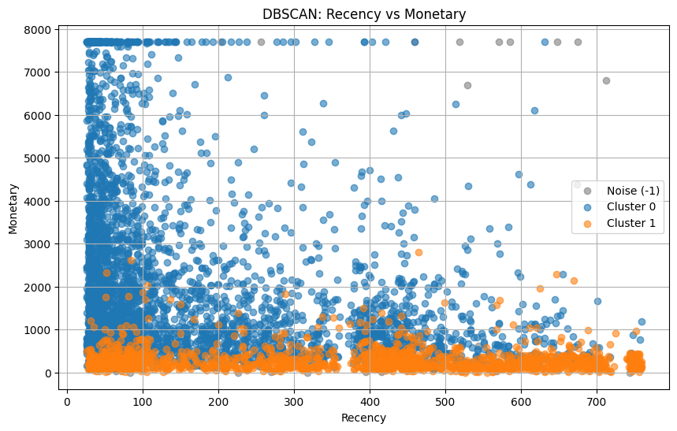
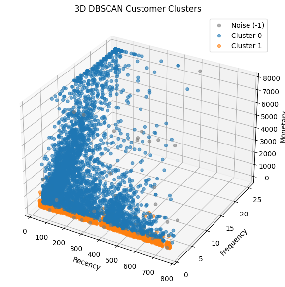

# 🧩 Customer Segmentation — RFM + Unsupervised Learning

<p align="center">

**Turning millions of retail transactions into actionable customer segments using RFM Analysis and Unsupervised Machine Learning.**

<br>


</p>

---

## 📌 Project Overview

Customer segmentation is the process of grouping customers based on similar purchasing behaviour.

In this project, an **Online Retail transaction dataset** is transformed from transaction-level data into customer-level behavioural features using **RFM Analysis**:

* **R — Recency:** How recently a customer purchased
* **F — Frequency:** How frequently a customer purchased
* **M — Monetary:** How much a customer spent

After feature engineering and preprocessing, multiple unsupervised learning algorithms are evaluated:

* 🔵 K-Means Clustering
* 🌳 Agglomerative Hierarchical Clustering
* 🔷 DBSCAN

The goal is to identify meaningful customer groups and translate those groups into actionable business insights.

---

## 🎯 Business Problem

Retail businesses have thousands of customers with different purchasing behaviours.

Treating every customer in the same way can lead to inefficient marketing campaigns.

This project answers questions such as:

* Who are the most valuable customers?
* Which customers purchase frequently?
* Which customers have not purchased recently?
* Are there naturally occurring customer groups?
* Which clustering algorithm provides the most useful segmentation?
* How can customer segments support targeted marketing?

---

## 🎯 Project Objectives

* Clean and preprocess large-scale transaction data.
* Restrict analysis to relevant UK customers.
* Remove invalid transactions and missing customer identifiers.
* Create customer-level **RFM features**.
* Detect and control extreme values.
* Apply log transformation and feature scaling.
* Compare multiple clustering algorithms.
* Evaluate clustering quality using internal metrics.
* Analyse cluster behaviour using RFM characteristics.
* Translate clusters into meaningful business insights.
* Save the final scaler and clustering model for reuse.

---

# 🔄 End-to-End Workflow

```text
Raw Online Retail Data
          ↓
Data Cleaning
          ↓
UK Customer Filtering
          ↓
Remove Missing / Invalid Transactions
          ↓
Create TotalPrice
          ↓
Customer-Level Aggregation
          ↓
RFM Feature Engineering
          ↓
Outlier Treatment
          ↓
Log Transformation
          ↓
StandardScaler
          ↓
┌───────────────────────────────┐
│     Unsupervised Models       │
│                               │
│  K-Means                      │
│  Agglomerative Clustering     │
│  DBSCAN                       │
└───────────────────────────────┘
          ↓
Clustering Evaluation
          ↓
Cluster Interpretation
          ↓
Customer Personas
          ↓
Business Recommendations
```

---

# 📊 Dataset

The project uses the **Online Retail Dataset**.

The original dataset contains:

| Attribute             |          Value |
| --------------------- | -------------: |
| Original Transactions |      1,048,575 |
| Columns               |              8 |
| Cleaned Transactions  |        714,245 |
| Unique Customers      |          5,337 |
| Country Focus         | United Kingdom |

### Main Features

| Feature       | Description               |
| ------------- | ------------------------- |
| `Invoice`     | Invoice number            |
| `StockCode`   | Product/item code         |
| `Description` | Product description       |
| `Quantity`    | Number of units purchased |
| `InvoiceDate` | Transaction date and time |
| `Price`       | Unit price                |
| `Customer ID` | Customer identifier       |
| `Country`     | Customer country          |

### Dataset Source

The dataset is available from the UCI Machine Learning Repository:

**Online Retail Dataset**

https://archive.ics.uci.edu/dataset/352/online+retail

---

# 🧹 Data Cleaning

The raw transaction data contains missing values, returns and invalid transaction values.

The following preprocessing steps were performed:

### 1. Country Filtering

Only customers from the **United Kingdom** were retained.

### 2. Missing Customer IDs

Rows without a valid `Customer ID` were removed because customer-level segmentation requires a customer identifier.

### 3. Returns / Cancellations

Transactions with non-positive quantities were removed.

### 4. Invalid Prices

Rows containing zero or negative prices were removed.

### 5. Total Transaction Value

A new feature was created:

```python
TotalPrice = Quantity × Price
```

### 6. Date Conversion

`InvoiceDate` was converted into a proper datetime format.

### Result

```text
1,048,575 raw transactions
          ↓
      Cleaning
          ↓
714,245 valid transactions
          ↓
5,337 unique customers
```

---

# 📊 Exploratory Data Analysis

## 1️⃣ Transaction-Level Analysis

The first stage explores transaction-level behaviour, including quantity, unit price and total transaction value.

<p align="center">
  
</p>

### Key Analysis

- Quantity distribution
- Unit price distribution
- Total transaction value distribution
- Log scale used for Total Price because of high skewness

---

## 2️⃣ Customer Spending Analysis

Customer-level spending was analysed to understand the distribution of total customer revenue.

<p align="center">
  
</p>

This analysis helps identify customers with significantly higher spending behaviour.

---

# 🧮 RFM Analysis & Preprocessing

## 3️⃣ RFM Features — Before Outlier Treatment

The initial RFM distributions were analysed before applying outlier treatment.

<p align="center">
  
</p>

The analysis covers:

- Recency
- Frequency
- Monetary

---

## 4️⃣ RFM Features — After Outlier Capping

An IQR-based capping approach was applied to reduce the influence of extreme values.

<p align="center">
  
</p>

---

## 5️⃣ RFM Features — Before Log Transformation

Frequency and Monetary showed strong right-skewness before transformation.

<p align="center">
  
</p>

---

## 6️⃣ RFM Features — After Log Transformation

`log1p()` transformation was applied to Frequency and Monetary features to reduce skewness.

<p align="center">
  
</p>

---

# 🤖 K-Means Clustering

## 7️⃣ Elbow Method & Silhouette Score

Multiple values of `k` were evaluated using the Elbow Method and Silhouette Score.

<p align="center">
  
</p>

These metrics were used to determine a suitable number of customer clusters.

---

## 8️⃣ K-Means — Recency vs Monetary

The customer segments are visualized using Recency and Monetary behaviour.

<p align="center">
  
</p>

---

## 9️⃣ K-Means — Frequency vs Monetary

The relationship between purchase frequency and monetary value is visualized below.

<p align="center">
  
</p>

---

## 🔟 3D K-Means Customer Segmentation

The three RFM dimensions are visualized simultaneously:

- Recency
- Frequency
- Monetary

<p align="center">
  
</p>

---

# 🌳 Hierarchical Clustering

## 1️⃣1️⃣ Hierarchical Clustering Dendrogram

Ward linkage was used to visualize the hierarchical structure of customer groups.

<p align="center">
  
</p>

The dendrogram helps determine a suitable cluster structure.

---

## 1️⃣2️⃣ Hierarchical — Recency vs Monetary

The resulting hierarchical clusters are visualized using Recency and Monetary.

<p align="center">
  
</p>

---

## 1️⃣3️⃣ 3D Hierarchical Customer Clusters

The hierarchical segmentation is further visualized across all three RFM dimensions.

<p align="center">
  
</p>

---

# 🔵 DBSCAN Clustering

## 1️⃣4️⃣ DBSCAN k-NN Distance Plot

The k-nearest-neighbour distance plot was used to investigate a suitable epsilon (`eps`) value for DBSCAN.

<p align="center">
  
</p>

---

## 1️⃣5️⃣ DBSCAN Hyperparameter Tuning

Different combinations of `eps` and `min_samples` were evaluated using silhouette score.

<p align="center">
  
</p>

This heatmap helps identify parameter combinations that produce better-separated clusters.

---

## 1️⃣6️⃣ DBSCAN — Recency vs Monetary

DBSCAN customer clusters are visualized using Recency and Monetary.

Noise points identified by DBSCAN are represented separately.

<p align="center">
  
</p>

---

## 1️⃣7️⃣ 3D DBSCAN Customer Segmentation

The final DBSCAN structure is visualized using all three RFM dimensions.

<p align="center">
  
</p>

---

# 📊 Clustering Model Comparison

The three unsupervised learning algorithms were evaluated using internal clustering metrics:

| Metric | Purpose | Better Direction |
|---|---|---|
| Silhouette Score | Cluster separation and cohesion | Higher ↑ |
| Davies-Bouldin Index | Cluster similarity | Lower ↓ |
| Calinski-Harabasz Index | Between/within cluster dispersion | Higher ↑ |

The comparison is performed directly in the notebook using the final K-Means, Agglomerative and DBSCAN labels. 

---

# 👥 Customer Segmentation

The final clusters are analysed using RFM characteristics to understand customer behaviour.

### RFM Interpretation

| Feature | Meaning |
|---|---|
| **Recency** | How recently the customer purchased |
| **Frequency** | How frequently the customer purchased |
| **Monetary** | How much the customer spent |

The resulting customer groups can be interpreted using their RFM profiles rather than relying only on cluster numbers.

---

# 💡 Business Insights

The segmentation can support:

- 🎯 Targeted marketing campaigns
- ❤️ Customer retention
- 💎 Loyalty programs
- 🛍️ Cross-selling
- 🔄 Customer reactivation
- 📊 Customer behaviour monitoring

---

# 🔄 Complete Project Workflow

<p align="center">
  
</p>

---

# 📌 Project Overview

<p align="center">
  
</p>

# 📊 Clustering Model Comparison

| Algorithm     | Configuration          | Clusters | Silhouette | Davies-Bouldin | Calinski-Harabasz |  Noise |
| ------------- | ---------------------- | -------: | ---------: | -------------: | ----------------: | -----: |
| **K-Means**   | k=2                    |        2 | **0.4322** |     **0.8689** |       **5825.55** |     0% |
| Agglomerative | k=4, Ward              |        4 |     0.3441 |         0.9024 |           5036.51 |     0% |
| DBSCAN        | eps=0.5, min_samples=5 |        2 |     0.3306 |         1.0381 |           3091.64 | 48.72% |

### Evaluation Metrics

#### Silhouette Score

Measures how well each observation fits within its assigned cluster compared with other clusters.

**Higher is generally better.**

#### Davies-Bouldin Index

Measures average similarity between clusters.

**Lower is generally better.**

#### Calinski-Harabasz Index

Measures the ratio of between-cluster dispersion to within-cluster dispersion.

**Higher is generally better.**

---

# 🔁 K-Means Stability Testing

The selected K-Means configuration was evaluated across multiple random states:

```text
0
7
21
42
99
```

The reported mean silhouette score was:

```text
Mean = 0.4322
Std = 0.0000
```

The notebook therefore reports highly consistent results across these tested random states.

---

# 👥 Customer Segmentation & Personas

The final customer segments should be interpreted using their **RFM profiles**, rather than assigning arbitrary names solely from cluster numbers.

Typical business interpretations include:

### 🏆 High-Value / Loyal Customers

Characteristics may include:

* Low Recency
* High Frequency
* High Monetary value

Potential actions:

* Loyalty rewards
* Exclusive offers
* Early product access
* Cross-selling
* Personalized recommendations

---

### 🌱 Low-Engagement Customers

Characteristics may include:

* Lower purchase frequency
* Lower spending
* Less recent activity

Potential actions:

* Welcome campaigns
* Second-purchase incentives
* Product recommendations
* Engagement campaigns

---

### ⚠️ At-Risk Customers

Characteristics may include:

* High Recency
* Reduced purchase activity

Potential actions:

* Reactivation campaigns
* Limited-time discounts
* Personalized reminders
* Win-back campaigns

> **Note:** Persona names should always be based on the actual RFM statistics of the final cluster profiles. They should not be assumed solely from the cluster number.

---

# 💡 Business Insights

This project demonstrates how raw transaction data can be converted into customer-level intelligence.

### Key Insights

* Large transaction datasets can be reduced to meaningful customer-level features.
* RFM provides a practical framework for understanding customer behaviour.
* Feature preprocessing has a major impact on clustering.
* Different clustering algorithms produce different segmentation structures.
* K-Means produced the strongest internal clustering metrics among the tested configurations.
* DBSCAN identified a substantial number of observations as noise under the selected parameters.
* Customer segments can support targeted marketing and retention strategies.

---

# 🚀 Business Applications

The resulting segmentation can support:

### 🎯 Targeted Marketing

Send different campaigns to different customer groups.

### ❤️ Customer Retention

Identify customers whose purchasing activity has declined.

### 💎 Loyalty Programs

Provide rewards to highly engaged customers.

### 🛍️ Cross-Selling

Recommend complementary products based on purchasing behaviour.

### 🔄 Customer Reactivation

Target customers who have not purchased recently.

### 📊 Customer Analytics

Monitor changes in customer behaviour over time.

---

# 💾 Saved Machine Learning Artifacts

The project saves the preprocessing and clustering components for reuse:

```text
rfm_scaler.pkl
customer_segmentation_model.pkl
```

### `rfm_scaler.pkl`

Stores the fitted feature scaler.

### `customer_segmentation_model.pkl`

Stores the final K-Means clustering model.

The saved K-Means model uses:

```text
n_clusters = 2
random_state = 42
```

---

# 📁 Project Structure

```text
customer-segmentation-unsupervised-learning/
│
├── 📂 assets/
│   └── 📊 Project visualizations
│
├── 📓 customer_segmentation.ipynb
│
├── 🤖 customer_segmentation_model.pkl
│
├── ⚙️ rfm_scaler.pkl
│
├── 📄 requirements.txt
│
├── 📝 summary_report.md
│
└── 📖 README.md
```

---

# 🛠️ Tech Stack

### Programming

* Python

### Data Analysis

* Pandas
* NumPy

### Visualization

* Matplotlib
* Seaborn

### Machine Learning

* Scikit-learn

### Model Persistence

* Joblib

### Development Environment

* Jupyter Notebook
* VS Code
* GitHub

---

# ▶️ How to Run the Project

### 1. Clone the Repository

```bash
git clone https://github.com/pmanan2031-web/customer-segmentation-unsupervised-learning.git
```

### 2. Navigate to the Project

```bash
cd customer-segmentation-unsupervised-learning
```

### 3. Install Dependencies

```bash
pip install -r requirements.txt
```

### 4. Launch Jupyter Notebook

```bash
jupyter notebook
```

Open:

```text
customer_segmentation.ipynb
```

### 5. Run the Notebook

Execute the notebook cells from top to bottom to reproduce:

```text
Data Cleaning
      ↓
EDA
      ↓
RFM
      ↓
Preprocessing
      ↓
K-Means
      ↓
Hierarchical Clustering
      ↓
DBSCAN
      ↓
Evaluation
      ↓
Customer Segmentation
```

---

# 📊 Project Highlights

```text
1,048,575
     ↓
Raw Transactions

714,245
     ↓
Cleaned Transactions

5,337
     ↓
Unique Customers

RFM Features
     ↓
3 Clustering Algorithms
     ↓
Model Evaluation
     ↓
Customer Segmentation
     ↓
Business Insights
```

---

# 📌 Limitations

* The analysis is based on historical transaction behaviour.
* Clustering results depend on feature engineering and preprocessing.
* The selected number of clusters is specific to the evaluated dataset and methodology.
* DBSCAN performance is sensitive to `eps` and `min_samples`.
* Customer personas should be validated with actual business/customer data before production use.
* Internal clustering metrics do not necessarily represent direct business impact.

---

# 🔮 Future Improvements

Possible extensions include:

* Add PCA-based 2D/3D cluster visualization.
* Build an interactive Streamlit dashboard.
* Add automatic customer segment prediction.
* Experiment with Gaussian Mixture Models.
* Perform systematic hyperparameter tuning for DBSCAN.
* Track customer segments over time.
* Add CLV (Customer Lifetime Value).
* Build a marketing recommendation engine.
* Deploy the segmentation model as a web application.
* Add automated model monitoring.

---

# ⭐ Key Takeaway

> **This project demonstrates an end-to-end unsupervised machine learning workflow that converts raw retail transactions into actionable customer segments using RFM analysis and clustering.**

It combines:

**Data Cleaning → EDA → Feature Engineering → RFM → Outlier Treatment → Scaling → Clustering → Evaluation → Customer Personas → Business Insights**

---

# 👨‍💻 Author

## Manan Patel

Data Science / Machine Learning Enthusiast

🔗 **GitHub:**
https://github.com/pmanan2031-web

🔗 **Project Repository:**
https://github.com/pmanan2031-web/customer-segmentation-unsupervised-learning

---

<p align="center">

### ⭐ If you found this project useful, consider giving the repository a star!

**Built with Python & Scikit-learn**

</p>
