# 🧩 Customer Segmentation — RFM + Clustering

A complete customer segmentation project built from an Online Retail transaction dataset.

The notebook performs data cleaning, RFM feature engineering, outlier handling, scaling,
and compares **K-Means, Agglomerative Hierarchical Clustering, and DBSCAN**.

## 📌 Project Overview

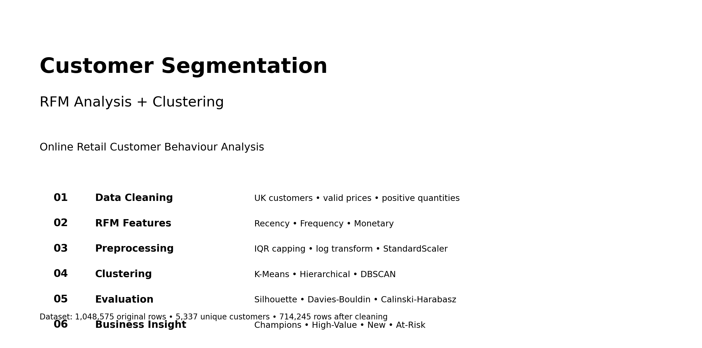

> **Tip:** Every graph below is clickable. Click/tap a graph to open the full-size image.

## 🔄 Project Workflow

[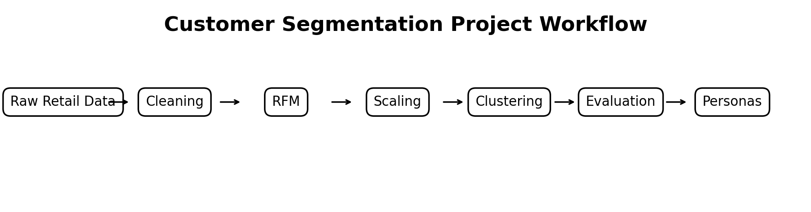](assets/workflow.png)

## 📊 Dataset & Cleaning

The notebook starts with **1,048,575 rows and 8 columns**. The data contains Invoice,
StockCode, Description, Quantity, InvoiceDate, Price, Customer ID, and Country.

Cleaning steps include:

- Keep **United Kingdom** customers
- Remove missing Customer IDs
- Remove returns/cancellations using positive Quantity
- Remove invalid/non-positive prices
- Create `TotalPrice = Quantity × Price`
- Convert `InvoiceDate` to datetime

After cleaning, the notebook reports **714,245 rows** and **5,337 unique customers**.

## 📈 Step 1 — Exploratory Analysis

### Quantity, Unit Price & Total Price

[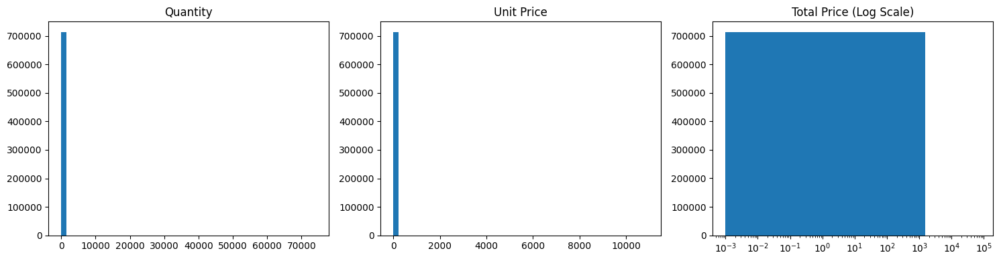](assets/graph_01.png)

### Monthly Transactions / Customer-Level Analysis

[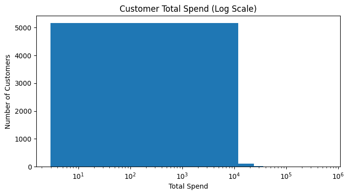](assets/graph_02.png)

The notebook reports the highest transaction month as **2011-11** and total revenue of
approximately **£14.34 million**.

## 🧮 Step 2 — RFM Feature Engineering

RFM means:

| Feature | Meaning |
|---|---|
| **Recency** | How recently the customer purchased |
| **Frequency** | Number of unique invoices |
| **Monetary** | Total customer spending |

The project then:

1. Builds the customer-level RFM table
2. Detects/caps extreme values using the IQR approach
3. Applies log transformation to Frequency and Monetary
4. Standardizes the clustering features using `StandardScaler`

### RFM Before/After Outlier Treatment

[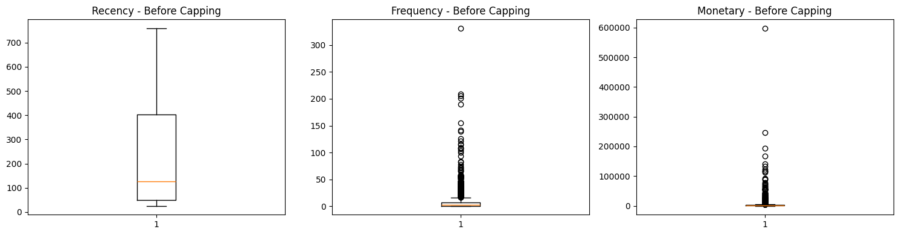](assets/graph_03.png)

[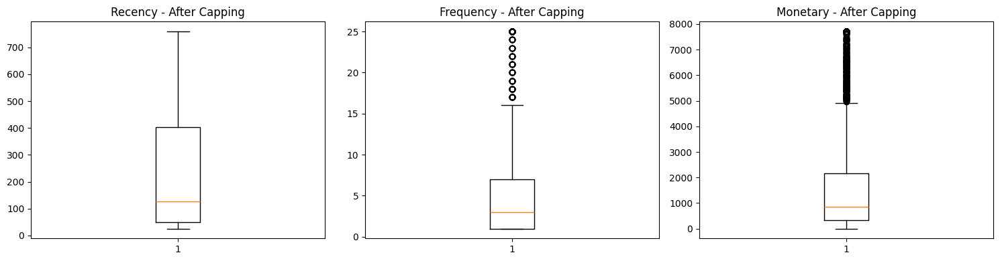](assets/graph_04.png)

[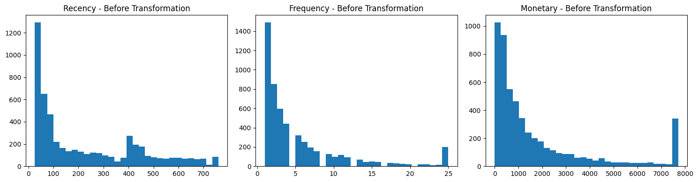](assets/graph_05.png)

[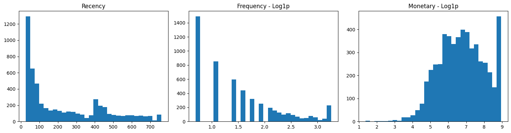](assets/graph_06.png)

## 🤖 Step 3 — K-Means Clustering

The notebook tests **k = 2 to 10** using both inertia and silhouette score.

The recorded silhouette scores are:

- k=2 → **0.4322**
- k=3 → 0.4081
- k=4 → 0.3737
- k=5 → 0.3832
- k=6 → 0.3522
- k=7 → 0.3440
- k=8 → 0.3445
- k=9 → 0.3187
- k=10 → 0.3167

The notebook selects **k = 2**.

### Elbow + Silhouette

[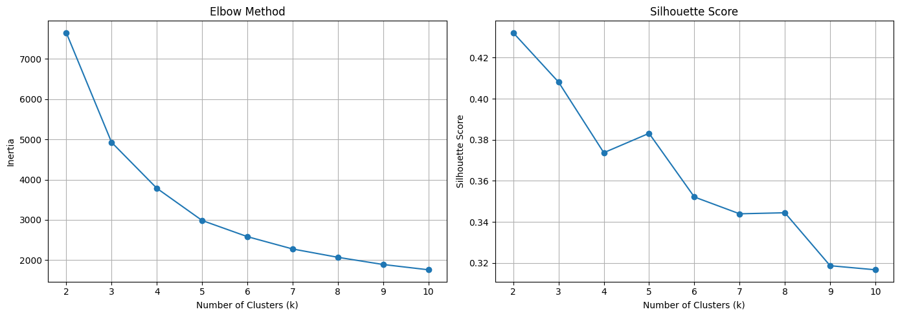](assets/graph_07.png)

### K-Means Customer Clusters

[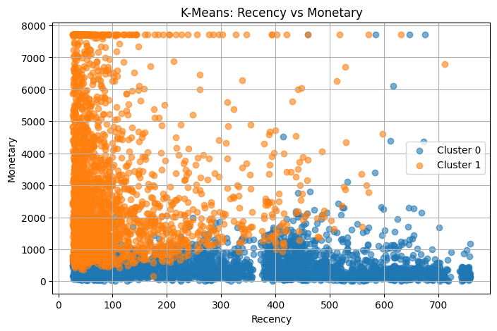](assets/graph_08.png)

[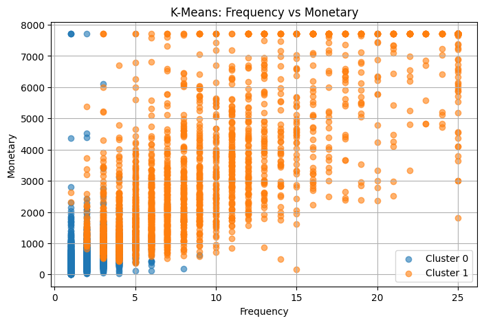](assets/graph_09.png)

## 🌳 Step 4 — Agglomerative Hierarchical Clustering

The notebook uses a dendrogram and tests different linkage methods.

### Hierarchical Dendrogram

[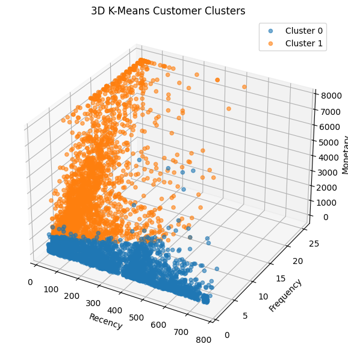](assets/graph_10.png)

### Hierarchical Clusters

[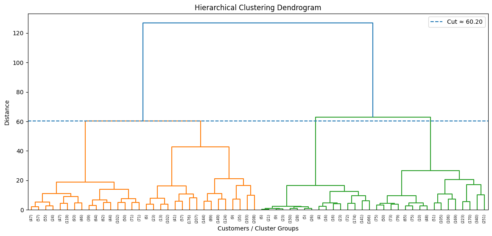](assets/graph_11.png)

[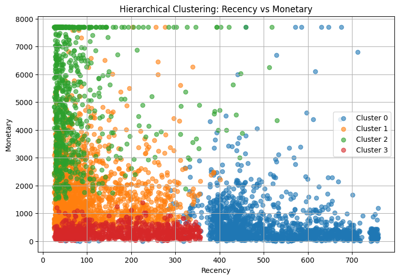](assets/graph_12.png)

The notebook compares **ward, complete, and average** linkage using silhouette score.

## 🔵 Step 5 — DBSCAN Clustering

DBSCAN is tuned using `eps` and `min_samples`.

The notebook records an optimized configuration of:

- `eps = 0.5`
- `min_samples = 5`

It also identifies noise/outlier customers.

### DBSCAN Tuning

[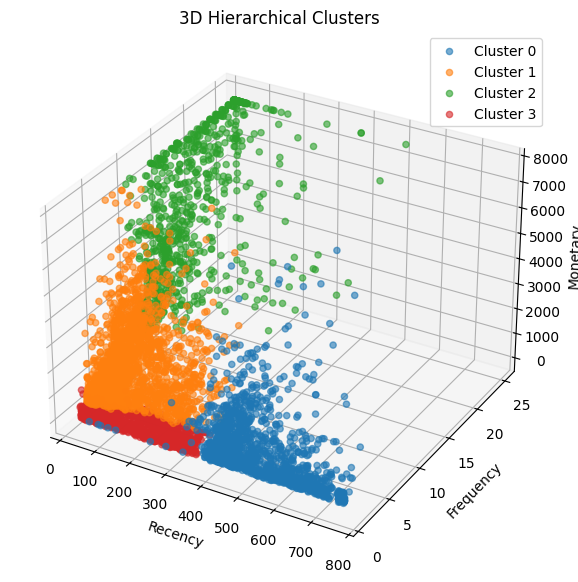](assets/graph_13.png)

### DBSCAN Customer Clusters

[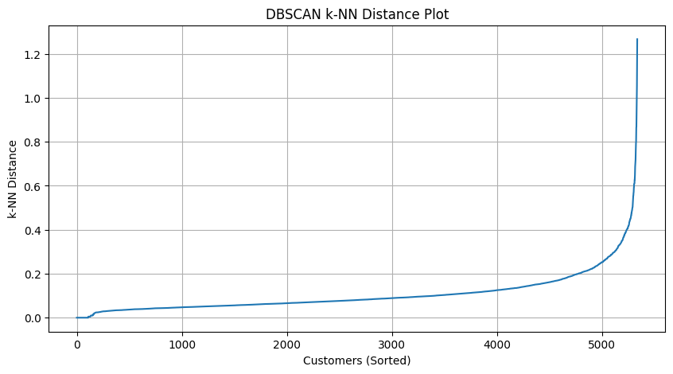](assets/graph_14.png)

[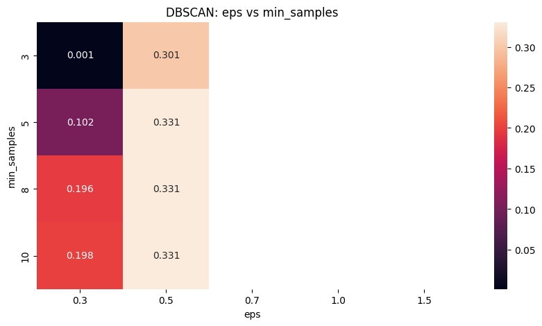](assets/graph_15.png)

## 📊 Step 6 — Algorithm Comparison

The notebook compares the tested algorithms using internal clustering metrics.

| Algorithm | Configuration | Clusters | Silhouette | Davies-Bouldin | Calinski-Harabasz | Noise % |
|---|---|---:|---:|---:|---:|---:|
| K-Means | k=2 | 2 | 0.4322 | 0.8689 | 5825.5544 | 0.0000 |
| Agglomerative | k=4, linkage=ward | 4 | 0.3441 | 0.9024 | 5036.5093 | 0.0000 |
| DBSCAN | eps=0.5, min_samples=5 | 2 | 0.3306 | 1.0381 | 3091.6430 | 0.4872 |

### K-Means Stability

The notebook tests random states **0, 7, 21, 42, and 99**. The mean silhouette score is
**0.4322** with a reported standard deviation of **0.0**, and the notebook describes the
result as relatively stable across runs.

## 👥 Customer Personas

The notebook defines business personas based on RFM cluster profiles:

### 🏆 Champions
Recently purchased, frequent and high-spending customers.

**Suggested action:** loyalty rewards, early access and exclusive offers.

### 💎 High-Value Customers
Customers with comparatively high monetary value.

**Suggested action:** premium offers, cross-selling and personalized recommendations.

### 🌱 New Customers
Customers with lower purchase frequency or spending.

**Suggested action:** welcome offers and second-purchase campaigns.

### ⚠️ At-Risk Customers
Customers with high recency values, indicating they have not purchased recently.

**Suggested action:** targeted reactivation offers and limited-time discounts.

## 🚀 Step 7 — Deployment / Model Pipeline

The notebook saves:

- `rfm_scaler.pkl`
- `customer_segmentation_model.pkl`

The final saved K-Means model uses **2 clusters** and `random_state=42`.

## 🧠 Business Value

This project demonstrates how transaction data can be transformed into customer-level
behaviour segments instead of treating every customer identically.

Potential uses include:

- Targeted marketing campaigns
- Customer retention
- Loyalty programs
- Personalized offers
- Cross-selling
- Reactivation of at-risk customers

## 🛠️ Technologies

`Python` · `Pandas` · `NumPy` · `Matplotlib` · `Scikit-learn` · `Joblib`

## 📁 Suggested GitHub Structure

```text
customer-segmentation/
│
├── customer_segmentation.ipynb
├── README.md
├── assets/
│   ├── project_overview.png
│   ├── workflow.png
│   ├── graph_01.png
│   ├── graph_02.png
│   └── ...
├── customer_segmentation_model.pkl
└── rfm_scaler.pkl
```

---

### ⭐ Project Highlights

**1,048,575** original transactions → **714,245** cleaned rows → **5,337** unique customers → RFM features → **3 clustering algorithms** → customer personas and business actions.

## Dataset

Online Retail Dataset was used for this project.

Dataset Source:
https://archive.ics.uci.edu/dataset/352/online+retail
